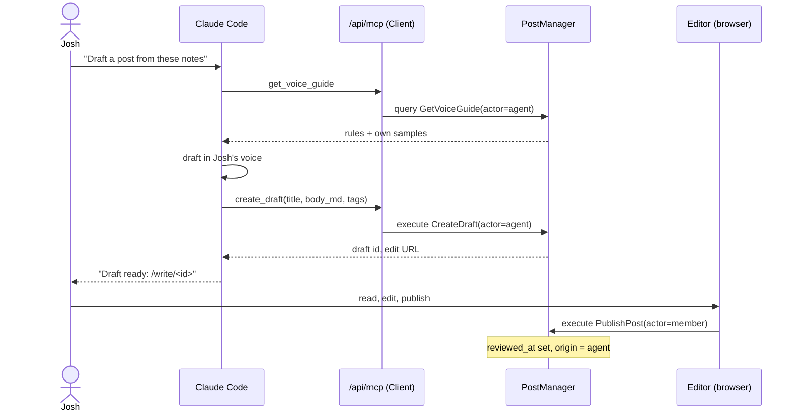

# Agent publishing — proposal (candidate D22)

Written 2026-09-12. Plan only. Nothing here is built. This file is a candidate entry for
[WAYFINDER.md](WAYFINDER.md) and a candidate set of issues for `Wintaru/porchlight`. The forks in
section 8 are settled, the map carries D22, SPEC.md §17 is the builder text, and the issues are
#27–#32.

## 1. What Josh asked for

Claude should plug into Porchlight and publish posts for Josh. Markdown posts, and file
uploads to go with them. Both must work from Claude Code without a browser.

Josh added a second, stronger requirement. The posts must not read as AI-written, and
Porchlight must not add to the AI slop on the internet. His idea: a person works with
their agent, and the agent remembers and adopts their writing style.

## 2. The short version

Porchlight grows one door for agents: an MCP endpoint at `/api/mcp`, inside the Next.js
app. A member mints a personal token on the settings page and gives it to Claude Code.
The agent then acts **as that member**, with the member's trust level, through the same
`PostManager` and `MediaManager` every screen uses. Nothing bypasses moderation.

**Porchlight never calls Anthropic.** The site is the MCP *server*. Claude Code, running
on Josh's Pro or Max subscription, is the *client* that connects to it. The only key in
this design is a Porchlight token that Josh mints on his own site. No Anthropic API key is
needed anywhere, and the plan adds no call from the server to any model.

Three rules keep the posts yours:

1. **Agents write drafts. People publish.** A token can create and edit drafts. Publishing
   through the agent is a separate scope, off by default.
2. **The agent writes in your voice, from your notes.** Each member owns a voice guide
   (rules, banned phrases, and samples of their own hand-written posts). The server hands
   it to the agent before it drafts. The guide grows from the edits you make to the
   agent's drafts, with your approval each time.
3. **Provenance is recorded, always.** Every post knows whether an agent wrote it and
   whether a person reviewed it. Readers see a disclosure line if the site owner turns it
   on.

## 3. How a post gets written

Uploads follow the same shape. The agent asks for an upload URL, Claude Code sends the
bytes with `curl` straight to storage, and the agent finalizes. The file bytes never pass
through the model's context.

## 4. Keeping it yours — the anti-slop design

Josh's worry has two parts. The posts must sound like him, and the site must not become a
place that pumps out machine text. The tools below answer both. The strongest ones are
workflow rules, not clever code.

### 4.1 A person reads every word before it goes public (default)

The default token scope is `posts:draft`. The agent can create, update and delete drafts.
It cannot publish. Josh opens the draft in the editor, reads it, edits it, and publishes.
This is the one control that works against slop regardless of how good the model is.

A member who wants full autonomy mints a token with `posts:publish`. The site records that
the post went out without a human edit (section 4.5). The choice is the member's, and the
record is honest.

### 4.2 A voice guide the member owns

Josh's idea, made concrete. Each member has a **voice guide**: a markdown document on
their profile, edited on the settings page and served to the agent by `get_voice_guide`.
It holds:

- **Rules.** "Short sentences. No em dashes. Swear a little. Never open with a question.
  Never end with a summary paragraph."
- **Banned phrases.** A default list ships ("delve", "tapestry", "it's worth noting",
  "in today's fast-paced world", "let's dive in") and the member adds their own.
- **Samples.** The server appends the member's own recent posts as few-shot examples.
  Only posts with `origin = editor` count. A post the agent wrote never feeds the guide,
  or the agent learns from itself and drifts toward slop.
- **Topics and stances.** What the member cares about and what they think, so the agent
  does not invent opinions.

The guide is content the member owns. It exports with everything else and erases with
the account (SPEC.md §10).

### 4.3 The guide learns from your edits, with your approval

This is the "remember and adopt" loop. When the agent creates a draft, the server keeps
the agent's original text on the post (`agent_draft_md`). When Josh edits and publishes,
the agent can call `get_post` and compare the published text with what it sent. From the
diff it proposes rules ("you cut every rhetorical question, add a rule?"). Josh says yes
or no. `update_voice_guide` writes the accepted rule.

The memory lives on the site, not in the model. It follows Josh across machines and
across agents. It is his, readable, and editable by hand.

### 4.4 House rules the server states to every agent

MCP lets a server send `instructions` when a client connects. Porchlight's say: draft from
the author's notes and voice guide only, do not pad, do not add a closing summary, do not
invent facts or opinions, one draft per request. Every connecting agent reads them before
it calls a tool.

### 4.5 Provenance recorded, disclosure configurable

Each post records `origin` (`editor | agent`), the token that wrote it, and `reviewed_at`
(the first save or publish by a signed-in person). The evidence envelope (SPEC.md §7)
records the token id too. The drafts list and the moderation queue show an "agent draft,
not yet reviewed" badge. The publish button in the editor warns on an unreviewed agent
draft. It warns, it does not block: a person may read carefully and change nothing.

Whether readers see a line under the post ("Drafted with an assistant, edited by
@josh") is a site setting, `agent_disclosure` (`off | footer`). The record exists
regardless of the setting. See fork 8.2 for the default.

### 4.6 Rate limits per token

A token gets a daily cap on drafts and on publishes (default 5 and 2), in `site_config`,
enforced through the existing `rate_limits` table (subject `token:<id>`). A porch with
fifty agent posts a day is a content farm. The cap makes that a deliberate admin choice.

### 4.7 Same moderation, no shortcuts

An agent post takes the same path as any post. A probation member's agent lands in
`pending`. Text moderation (issue #10) runs on it. Uploads land in quarantine and wait for
the scan. `posting = staff` denies the agent when it denies the member. There is no agent
bypass and this plan adds none.

### 4.8 Optional: a draft check

A `check_draft` tool that runs cheap heuristics: banned phrases, sentence-length
variance, tricolon density, header-per-paragraph, a closing summary paragraph. Returns
warnings. Deterministic, local, no vendor key (D19). It would help human writers in the
editor too. Honest assessment: heuristics catch the obvious and miss the rest. The
workflow rules above matter more. Marked as a later issue.

## 5. Decisions to settle

Each item states the recommendation, the reason, and what it rejects. This section is
also the decision log for this planning session.

### 5.1 The door: an MCP endpoint inside Next.js, bearer token

**Recommend:** `POST /api/mcp`, Streamable HTTP, stateless, built on
`@modelcontextprotocol/server`'s `createMcpHandler` (a web-standard `fetch` handler that a
Next.js route exports as is). Auth is `Authorization: Bearer plt_...`. Claude Code
connects with `claude mcp add --transport http porchlight <origin>/api/mcp --header
"Authorization: Bearer ${PORCHLIGHT_TOKEN}"`.

**Why:** One new dependency, no second process, no second deploy. The route is a Client
in iDesign terms and calls Managers like every other route. It runs locally against the
fake providers like everything else (D19). Claude Code supports static bearer headers on
HTTP servers today.

**Rejected:** A local stdio MCP package (a second thing to install and version, and the
bytes-through-the-model problem for uploads is solved by signed URLs anyway). A plain REST
API plus a Claude skill (works, but "plug in" means MCP, and REST can be added later if a
script needs it). OAuth 2.1 first (needed for claude.ai web connectors, but Supabase Auth
is not an OAuth server for third parties, and it would gate the whole feature on a second
auth system — see section 9).

### 5.2 Identity: the token is the member, and the actor says so

**Recommend:** A third `Actor` kind, `agent`, carrying the member's `Profile` and an
`AgentGrant` (token id, scopes). `PermissionEngine`'s exhaustive switch must then rule on
agents for every action. Agents get `post.create`, `post.edit` (own drafts), `post.delete`
(own drafts only, never a published post), `media.upload`, and `post.publish` only with
the scope. Everything else — profile edits, moderation, erasure, token management — is
denied for an agent actor.

**Why:** A new action with no agent rule becomes a type error, not a silent grant. The
member's trust level carries through unchanged, so D7 holds without new code.

**Rejected:** Treating the token as a plain member session (a bug in a token handler
would let an agent erase an account). A separate `agents` table with its own roles (a
second identity system for what is one person).

### 5.3 Tokens: shown once, stored hashed, revocable

**Recommend:** `plt_` + 32 random bytes, base64url. Stored as `sha256(token)`, same
pattern as `anonymous_authors.secret_hash`. Minted and revoked on `/settings`, section
"Agents". Each token has a name ("laptop", "desk"), scopes, optional expiry, and
`last_used_at`. No browser read path: RLS denies the table to every browser role, and the
Manager reads it with the service role.

**Why:** A leaked hash is useless. The `plt_` prefix lets secret scanners recognize it.
Named tokens let Josh revoke one machine.

### 5.4 Uploads: reuse issue #9's signed URL flow

**Recommend:** `request_upload(filename, mime, bytes, sha256)` calls `MediaManager
RequestUploadUrl` and returns a signed URL into the quarantine bucket plus a media id.
Claude Code runs `curl -T <file> <url>`. `finalize_upload(media_id)` runs the magic-byte
check and starts the scan (#10). The response says `scan_status` and, once clear and
approved, the public URL to put in the markdown.

**Why:** #9 already plans exactly this pair for the browser editor. The file bytes go from
disk to storage and never enter the model's context. A 2 MB image as base64 in a tool
argument would cost 2.7 MB of context per upload.

**Rejected:** Base64 in the tool call (the context cost above). A separate upload route
for agents (two upload paths to keep safe).

### 5.5 Voice guide storage

**Recommend:** `profiles.voice_guide_md text`. One column, edited on the settings page,
served by `get_voice_guide`, which appends the member's last N `origin = editor` published
posts as samples. Default banned-phrase list lives in code as a named constant.

**Rejected:** A `voice_guides` table with history (revisions are phase 2, #23, and the
guide can join them then). Storing the guide in the agent's own memory (not portable, not
the member's).

### 5.6 The site owner can turn agents off

**Recommend:** `site_config.agents` with values `members | staff | off`, default
`members`. Follows the D20 shape: a setting, not a mode. `off` hides the Agents section
and makes `/api/mcp` answer 403.

### 5.7 Rate limits live in `site_config`

**Recommend:** `site_config.agent_limits = {"drafts_per_day": 5, "publishes_per_day": 2}`.
Enforced by `QuotaEngine` (#9 introduces it) against `rate_limits`.

## 6. Journeys

Every role and every boring path. This is the completeness pass the map requires.

**Member**

- Opens `/settings`, section Agents. Mints a token: picks a name, scopes, expiry. Sees the
  token once, with the exact `claude mcp add` line to paste. Copies both.
- Sees the list of tokens with name, scopes, last used, expiry. Revokes one. The next
  MCP call with it gets 401.
- Writes and edits the voice guide on the same page. Sees the sample list it will send.
- Sees agent drafts in the drafts list with the badge. Opens one in `/write/<id>`.
  Edits. Publishes. The badge clears.
- Publishes an agent draft without an edit. Sees the warning. Confirms.
- Exports the account: the voice guide and the tokens list (names, not secrets) are in
  the bundle. Erases the account: tokens go with it, voice guide goes with it.

**Agent (through the token)**

- Connects. Reads `instructions`. Calls `get_me`: handle, trust level, scopes, the limits
  and how much of them is used today.
- Calls `get_voice_guide`. Drafts. Calls `create_draft`. Gets the id and the edit URL.
- Calls `list_posts(status=draft)`, `get_post(id)`, `update_draft(id, ...)`,
  `delete_draft(id)`.
- Calls `request_upload`, sends the bytes, calls `finalize_upload`. Gets `pending` and
  polls `get_media(id)` until clear, or gets `locked` and a plain refusal.
- Calls `publish_post(id)` with the scope: a probation member's post lands in `pending`,
  a trusted member's post goes live. Without the scope: a typed denial.
- Calls `update_voice_guide` after Josh accepts a proposed rule.
- Hits the daily cap: a typed denial that says which cap and when it resets.
- Uses a revoked or expired token: 401 with no other detail.

**Admin and moderator**

- Sets `agents` and `agent_limits` and `agent_disclosure` on the site config page (#12).
- Sees the origin badge on queue items. Approves or rejects as for any post.
- Reads `agent_token_id` in the evidence envelope for a reported post.

**Visitor**

- Reads a post. Sees the disclosure line if the site turned it on. Nothing else changes.

**Developer**

- Runs `supabase start`, `pnpm dev`, seeds a member with a token, and connects Claude
  Code to `http://localhost:3000/api/mcp`. Fake providers make uploads clear at once.
- Reads `docs/agents.md`: what the door is, how to mint a token, the `claude mcp add`
  line, the recommended notes-to-draft workflow, and what the fake mode does.

## 7. What changes, by layer

| Layer | Component | Change |
| --- | --- | --- |
| Common | `Actor` | Add `{ kind: "agent"; profile; grant: AgentGrant }`. |
| Common | `AgentGrant`, `AgentScope`, `PostOrigin` | New types. Scopes: `posts:draft`, `posts:publish`, `media:upload`, `voice:write`. |
| Accessor | `AgentTokenAccessor` | New. `store` (new token, revoke, touch last used), `load` (by hash, list by owner). Supabase + fake. |
| Accessor | `PostAccessor` | `NewPost` and `PostChanges` carry `origin`, `agentTokenId`, `agentDraftMd`, `reviewedAt`. |
| Accessor | `ProfileAccessor` | `voiceGuideMd` on `Profile` and `ProfileChanges`. |
| Accessor | `SiteConfigAccessor` | Load `agents`, `agent_limits`, `agent_disclosure`. |
| Engine | `PermissionEngine` | Rules for the `agent` actor on every action. New actions `media.upload`, `voice.edit`, `token.manage`. |
| Engine | `QuotaEngine` (#9) | Daily draft and publish counters per token. |
| Manager | `AccountManager` | `CreateAgentToken`, `RevokeAgentToken`, `UpdateVoiceGuide`. Queries `ListAgentTokens`, `ResolveAgentToken` (hash → `Actor`), `GetVoiceGuide`. |
| Manager | `PostManager` (#5) | Derives `origin` from the actor kind. Sets `reviewedAt` on a session actor's save or publish. Refuses `DeletePost` for an agent on a non-draft. |
| Manager | `MediaManager` (#9) | No new requests. The agent actor flows through. |
| Client | `apps/web/src/app/api/mcp/route.ts` | The MCP endpoint. Resolves the token to an actor once per request, then maps each tool to one Manager request. |
| Client | `apps/web/src/app/settings/` | Agents section: tokens and voice guide. |
| Client | `apps/web/src/app/write/` | Origin badge, unreviewed warning. |
| DB | migration | `agent_tokens` table. `posts.origin`, `posts.agent_token_id`, `posts.agent_draft_md`, `posts.reviewed_at`. `profiles.voice_guide_md`. `submission_evidence.agent_token_id`. RLS: deny browser roles on `agent_tokens`. Seed the three config keys. |
| Docs | `docs/agents.md`, `README.md`, `docs/deploy.md` | The connect guide. No production step: tokens are minted in the app. `deploy.md` gets one line saying so. |
| Tests | Vitest, Playwright, `packages/db` RLS test | Token resolution, permission rules, RLS denial. Playwright: mint → connect with the MCP client → draft appears → publish in the editor → renders. Revoke → 401. |

## 8. Forks, settled 2026-09-12 on the recommendations below

**8.1 Phase.** Build this right after #9 and #10 land (uploads need both), or ship the
post-only part right after #5 and add uploads later? **Recommend:** two steps. Tokens
plus post tools after #5. Upload tools after #10. Josh gets the drafting loop weeks
earlier.

**8.2 Disclosure default.** `agent_disclosure` default `off` or `footer`? `off` keeps
Josh's posts free of a label he may feel misrepresents edited work. `footer` is the
honest default for a self-hoster who never thinks about it. **Recommend:** `footer`,
because "err on the side of caution" is a standing constraint, and the line reads
"Drafted with an assistant, edited by @handle" only when a person actually edited. An
unreviewed agent post reads "Posted by an assistant for @handle". Josh can set `off` on
his own porch.

**8.3 Publish scope.** Allow `posts:publish` on tokens at all in v1, or drafts only?
**Recommend:** allow it, off by default, with the unreviewed record. A member who wants a
fully automatic pipeline can have one, and the site is honest about it.

**8.4 Map entry.** Record this as one decision (D22) with the seven sub-points in section
5, or as several decisions settled one per session as the map convention says?
**Recommend:** one D22 entry. The sub-points are one design, and splitting them would
take seven sessions for a feature that hangs together.

## 9. Later, not now

- **OAuth 2.1 for claude.ai web connectors.** The MCP spec's authorization flow needs an
  authorization server with dynamic client registration. Supabase Auth does not offer that
  for third-party clients today. When it matters, add a small authorization server route
  set, or adopt Supabase's when they ship one. Bearer tokens keep working beside it.
- **`check_draft` heuristics** (section 4.8).
- **A local stdio wrapper** for clients that cannot send headers.
- **Comments through the agent.** Not asked for. Adds nothing to the drafting loop.
- **Voice guide revisions**, when #23 lands.

## 10. Issues, filed 2026-09-12

Dependency order. Each is one small body of work. `Done when` is the acceptance test.
A = #27, B = #28, C = #29, D = #30, E = #31, F = #32 on `Wintaru/porchlight`.

**A. Agent tokens and the agent actor.** Depends on #5. Schema, `AgentTokenAccessor`,
`AccountManager` token requests, `Actor.agent`, `PermissionEngine` rules, RLS test,
settings Agents section (tokens only). *Done when:* a member mints a token, the token
resolves to an agent actor, an agent actor is denied `profile.edit`, and a revoked token
resolves to nothing.

**B. The MCP endpoint with post tools.** Depends on A. `/api/mcp`, `instructions`, tools
`get_me`, `list_posts`, `get_post`, `create_draft`, `update_draft`, `delete_draft`,
`publish_post`. Provenance columns. Rate limits. `docs/agents.md`. Playwright. *Done
when:* Claude Code connected with a token creates a draft that appears in `/write` with
the origin badge, a token without `posts:publish` is denied publish, and a publish through
a session actor sets `reviewed_at`.

**C. Voice guide.** Depends on B. `profiles.voice_guide_md`, settings editor,
`get_voice_guide` with samples that exclude agent posts, `update_voice_guide`,
`agent_draft_md` snapshot, the default banned-phrase list. *Done when:* the guide the
tool returns holds the member's rules and only hand-written samples, and an accepted rule
round-trips through `update_voice_guide`.

**D. Review signal and disclosure.** Depends on B, #6, #12. Unreviewed badge in the
drafts list and queue, publish warning, `agent_disclosure` footer, `agents` and
`agent_limits` on the config page. *Done when:* an unedited agent draft shows the badge
and the warning, and the footer appears only when the setting says so.

**E. Upload tools.** Depends on B, #9, #10. `request_upload`, `finalize_upload`,
`get_media`. *Done when:* Claude Code uploads a PNG through the signed URL, the fake
scanner clears it, and the URL renders in a published post. With the fake set to `lock`,
the tool answers with a refusal and the file never appears.

**F. Draft check (optional).** Depends on C.

## 11. Docs to read

- MCP specification, authorization: https://modelcontextprotocol.io/specification/latest/basic/authorization
- Claude Code, connecting HTTP MCP servers with headers: https://code.claude.com/docs/en/mcp
- MCP TypeScript SDK, `createMcpHandler` and stateless Streamable HTTP: https://github.com/modelcontextprotocol/typescript-sdk
- Supabase Storage, signed upload URLs: https://supabase.com/docs/reference/javascript/storage-from-createsigneduploadurl
