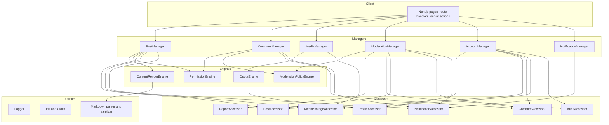
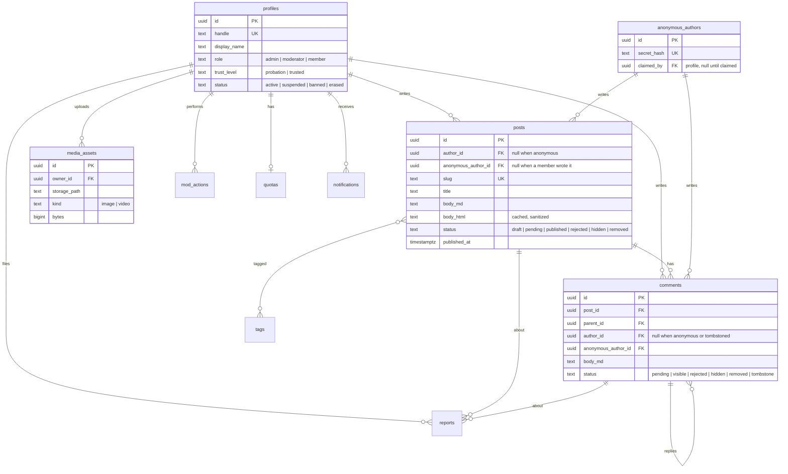

# Social Blog — First Sketch

Working name: **Porch** (a friendly place to sit and share). Change it any time.

Date: 2026-09-11. Status: idea stage. Nothing is decided yet.

## What it is

A public, open-source community blog. Members share posts and comment on them.
It has the useful parts of a subreddit (many authors, threads, tags, media) and
none of the parts that make people mean (karma, downvotes, leaderboards, anonymity).

The one-line goal: **a safe, searchable place to share fun things with people who
like the same things.**

## Principle: you own your content, fully, always

This is the headline difference from Reddit, Facebook and the rest. Their terms
give the platform a broad license to your words. Porch does not. What it means in
practice:

- **Yours to keep.** You hold the copyright to everything you post. Porch gets only
  the permission it needs to show it on the site. Nothing more.
- **Yours to take.** Export everything you made, in markdown and JSON, any time, in
  one click. No waiting period, no support ticket.
- **Yours to erase.** Delete everything you made, in one click. It is gone from the
  database and from storage, not hidden. Only an empty slot remains where a comment
  had replies, so other people's words still read in order (decision D5).
- **Never resold, never trained on.** Porch does not sell content, license it to
  third parties, or feed it to AI training. The open-source license covers the
  code, not the content.
- **Honest about the edges.** If someone erases a post, the comments on it go too
  (decision D6). The terms say this up front, and export exists so nobody loses
  their own words to someone else's erase.

The terms page and the account settings page both state this in plain words.

## Your requirements, restated

| # | Requirement | Notes |
| --- | --- | --- |
| R1 | Public pages that search engines index | Needs server rendering, not a plain SPA |
| R2 | Markdown posts and a WYSIWYG editor | Both must produce the same stored format |
| R3 | Sign in with Google (and other OAuth) | No passwords to store |
| R4 | Media and video uploads with limits | Limits for members, none for you |
| R5 | Supabase, React | Confirmed below with one addition |
| R6 | Screens and mockups first | Use the **design** skill for a canvas |
| R7 | Open source | License is a decision (see below) |
| R8 | iDesign, polymorphic request/response, handler dispatch | Server side |
| R9 | One-click "remove all my contributions" | Has a thread-integrity question |
| R10 | Admin moderation controls, a safe place | The biggest design area |

## Recommended stack

| Layer | Pick | Why |
| --- | --- | --- |
| Framework | **Next.js (App Router)** on React | Server rendering and static pages for SEO. Built-in metadata, sitemap and robots APIs. Supabase has first-party SSR docs for it. |
| Database, auth, storage | **Supabase** (Postgres, Auth, Storage) | You asked for it. It gives OAuth, row-level security and file storage in one place. |
| Editor | **Tiptap** (ProseMirror) | Real WYSIWYG. Has markdown import and export. Easy to add custom blocks (embeds, galleries). |
| Stored content format | **Markdown** as the source of truth, plus a cached, sanitized HTML column | Portable, diffable, easy to export. The cache keeps page renders fast. |
| Monorepo | **pnpm workspaces**: `apps/web`, `packages/core`, `packages/db` | Keeps the iDesign layers out of the web framework. |
| Boundary guard | `eslint-plugin-boundaries` | The layer call graph fails the build when broken. |
| Hosting (later) | Vercel or a Docker image | Both work with Next.js. Docker matters for self-hosters. |

Data access is **hybrid** (decision D2 on the map). Every write goes through the
Next.js server (the iDesign Client) and a Manager. Only Accessors hold a server
Supabase client. Public reads (feed, post page, profile) may query Supabase from the
browser under row-level security, but only from one `read-model` module that a lint
rule fences. This is a deliberate, bounded iDesign exception. It keeps Supabase
realtime and presence available for later. RLS policies are a primary wall for
reads, so they get tests.

## Architecture (iDesign)

Each Manager exposes only `execute(request)` and `query(request)`. Each request type
has one handler file. The composition root registers every handler once.

Example request flow, "publish a post":

1. `PublishPostRequest` enters `PostManager.execute`.
2. The resolver finds `PublishPostHandler`.
3. The handler asks `PermissionEngine` if this user can publish.
4. The handler asks `ContentRenderEngine` to turn markdown into safe HTML.
5. The handler calls `PostAccessor.store`.
6. It returns `PublishPostResponse` with the new slug.

## Core data model (first cut)

Roles: `admin` (you), `moderator`, `member`. Members carry a trust level: `probation`
(everything they write waits for approval) or `trusted` (publishes at once).

**Anonymous posting (decision D7).** Anyone can post or comment without an account.
Nothing anonymous shows until an admin approves it. On the first anonymous post the
server creates an `anonymous_authors` row: a random secret, stored only as a hash.
The secret goes back in an httpOnly cookie (page scripts cannot read it) and as a
one-time claim code the person can save. Later, signed in, the cookie or the code
proves the posts are theirs and `ClaimAnonymousPostsHandler` moves them to the
profile. If cookies are cleared and the code was not saved, the link is gone.

Every post and comment has a status that includes `pending`. The approval queue is
the heart of moderation, not an add-on.

## Feature list by phase

### Phase 1 — a working, safe blog

- Google OAuth sign-in. Profile with handle, display name, avatar, bio.
- Posts: create, edit, publish, draft, delete. Markdown and WYSIWYG editor.
- Comments: threaded replies, edit, delete.
- Tags. Tag pages. A home feed sorted by time (not by votes).
- Image upload with per-role quotas. Admin has no quota.
- SEO: server rendering, `sitemap.xml`, `robots.txt`, OpenGraph and Twitter cards,
  JSON-LD `Article`, canonical URLs, RSS feed.
- Anonymous posting and commenting, gated by the approval queue. Claim flow for
  anonymous posts (cookie plus claim code). Abuse guards for anonymous input (D15).
- Trust levels: probation and trusted. Admin promotion. Optional auto-promote rule.
- Moderation v1: the approval queue (pending posts and comments), report a post or
  comment, hide or remove content, suspend or ban a member, an audit log of every
  mod action.
- Notifications v1: in-app, through a `notifications` table and Supabase realtime.
  Events and channels are decisions D13 and D14.
- Account: "delete all my contributions" and "export my data".
- Code of conduct page. Report reasons that match it.

### Phase 2 — a good community

- Video upload under a size cap, plus YouTube and Vimeo embeds.
- Block and mute per member.
- Email notifications through one `EmailAccessor` (D14).
- Search with Postgres full-text search.
- Reactions with no public totals on profiles.
- Post revisions and edit history.

### Phase 3 — nice to have

- Email digests. Scheduled posts. Collections (curated groups of posts).
- Link previews. Content warnings and spoiler blocks.
- PWA and offline reading. Dark mode from the start, actually.
- ActivityPub federation (large — only if the community wants it).

## Suggestions you did not ask for

- **Kill the vote, keep the signal.** No downvotes. No public karma. Sort comments
  by time or by "author picks". This removes the main toxicity engine.
- **Gate showing, not writing.** Everyone can read (SEO). Anyone can write, even
  without an account. But nothing from an anonymous or probation author shows
  until an admin approves it. The approval queue is the wall (decision D7).
- **Trust is earned and visible to admins only.** Members start on probation.
  Admins promote by hand, or an optional rule promotes after N approved posts.
- **Slow mode.** A per-thread cooldown a moderator can switch on.
- **Tombstones for erasure.** When a member erases everything, their comments
  become empty `[deleted]` nodes so other people's replies keep their place.
  Their posts, media and profile go fully. (See decision D5.)
- **Export before erase.** Give members a JSON and markdown export. It costs little
  and it is the honest partner of one-click delete.
- **Spam and abuse at the edge.** Cloudflare Turnstile on sign-up. Rate limits per
  IP and per member. A word filter that holds, not blocks, for review.
- **Self-host story from day one.** A `docker compose` file with local Supabase,
  seed data, and one `.env.example`. Open-source projects live or die on this.
- **Observability.** Sentry for errors. A simple audit log table for anything a
  moderator does.
- **Accessibility.** Keyboard-first editor, alt text required on images, high
  contrast. Cheap early, expensive late.

## Decisions to make (the frontier)

These are the forks that change the shape of the work. Each is one conversation.
This table is the snapshot from the first sketch. [WAYFINDER.md](WAYFINDER.md) holds
the current state of each decision.

| # | Question | My recommendation |
| --- | --- | --- |
| D1 | Next.js, or React Router v7 framework mode, or Astro with React islands? | Next.js. Largest ecosystem for contributors and Supabase SSR docs. |
| D2 | Does the browser ever call Supabase directly? | No. All access goes through Managers. RLS stays on as defense in depth. |
| D3 | Stored format: markdown, ProseMirror JSON, or both? | Markdown as source of truth. Cached HTML column. Accept that a few rich formats are lossy. |
| D4 | Media storage: Supabase Storage, or Cloudflare R2 behind a CDN? | Start with Supabase Storage behind one `MediaStorageAccessor`. Egress cost decides later. Video transcoding is out of scope. |
| D5 | Erasure: cascade delete, or tombstone comments? | Tombstone comments. Hard-delete posts, media, profile. |
| D6 | What happens to other people's comments on an erased post? | Delete them with the post, and say so in the terms. The alternative (orphan comments) makes no sense to readers. |
| D7 | Membership: open, invite-only, or approve? | Ship the switch. Default to approve-new-members. |
| D8 | License: MIT or AGPL-3.0? | AGPL-3.0 if you want hosted forks to stay open. MIT if you want maximum adoption. |
| D9 | Reactions: none, likes only, or emoji reactions? | Emoji reactions with counts on posts, never on profiles. |
| D10 | Comment threading depth: unlimited, or capped (say 6)? | Cap it. Deep threads are unreadable on a phone. |
| D11 | Post URL shape: `/p/slug`, `/@handle/slug`, or `/yyyy/mm/slug`? | `/@handle/slug`. It gives authors ownership and reads well in search results. |
| D12 | Name and visual identity | Prototype on a design canvas before you decide. |

## Suggested next step

Map these decisions with **wayfinder** (one decision per session, written to a
`WAYFINDER.md` here since there is no git remote yet). Then design screens on a
canvas. Then scaffold the monorepo.

Screens to mock up first: home feed, post page with comments, editor, profile,
moderation queue, account settings (with the erase button).
